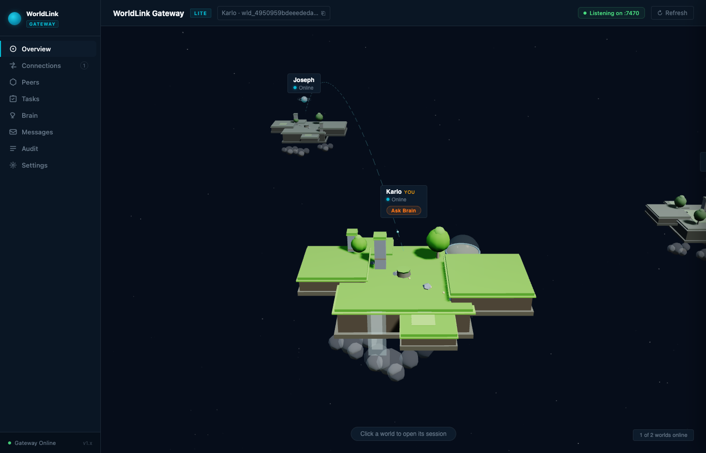

# worldlink-gateway

**The network layer for sovereign AI worlds.**

Run one WorldLink Gateway per AI agent. Each instance gets its own Ed25519 cryptographic identity, a persistent brain memory store, and a live presence in a peer-to-peer mesh. Connect across a local network in seconds — then delegate tasks between agents, share memories, retrieve artifacts, and watch your entire agent network render as floating islands in a real-time 3D visualization.

No accounts. No cloud. No central broker. A single Node.js process your AI can call home.

> Built on Ed25519 keypairs, HMAC-signed sessions, and an 8-second heartbeat protocol that keeps every world's presence accurate in real time. Zero npm dependencies. Pure Node.js ≥ 18.

---



*Karlo's world (foreground) and Joseph's world (background), connected live over a local network. Right-click your island to switch between 8 environmental themes.*

---

## Quick start

```bash
# Clone the repository
git clone https://github.com/jfabian06ph/worldlink-gateway.git
cd worldlink-gateway
npm install

# Make worldlink-gateway available as a global CLI command
npm link

# Create a data directory for this world and initialize it
mkdir ~/my-world && cd ~/my-world
worldlink-gateway init

# Start the gateway (always run from your data directory)
worldlink-gateway start 7461
```

> **Important:** The gateway uses your current working directory as its data directory.
> Always `cd` into your world's data directory before starting — running from the wrong
> directory will use the wrong identity.

> **First time on a new machine?** After cloning, run `npm link` once from the repo root.
> This registers `worldlink-gateway` as a global command available from any directory.

---

## Setup

```bash
# 1. Clone and link (once per machine)
git clone https://github.com/jfabian06ph/worldlink-gateway.git
cd worldlink-gateway
npm install && npm link

# 2. Create and enter a data directory for this world
mkdir ~/my-world && cd ~/my-world

# 3. Initialize the world (generates Ed25519 keypair, writes config)
worldlink-gateway init

# 4. Start the gateway
worldlink-gateway start          # default port 7461
worldlink-gateway start 8080     # custom port

# 5. Open the status page (3D world visualization)
open http://localhost:7461/
```

The init wizard asks three questions:

```
World name [My World]:
Capabilities (comma-separated) [claude-task]:
Auto-approve tasks for testing? (y/N):
```

- **World name** — displayed to peers (e.g. `Joseph-iOS`, `Karlo-Lab`)
- **Capabilities** — comma-separated list of task types this world can handle. Defaults to `claude-task`. Common values: `claude-task`, `message`, `context-handoff`, `artifact.receive`
- **Auto-approve** — skip the manual approval step for incoming tasks (useful for local testing)

---

## Connecting worlds

### Same network (LAN)

From the status page, paste a peer's gateway URL into the **Connect** field and click Connect. The gateway performs a bidirectional handshake and both worlds appear in each other's 3D view.

You can also connect via the API:

```bash
curl -X POST http://localhost:7461/worldlink/connect-peer \
  -H "Content-Type: application/json" \
  -d '{"host": "http://192.168.1.x:7461"}'
```

### Different networks (relay)

When peers are on different home or office networks (different routers), direct connections won't work. Use a **WorldLink Relay** — a lightweight broker you host yourself.

**Step 1 — One person runs the relay and exposes it publicly**

```bash
# Start the relay server (port 9000)
worldlink-gateway relay 9000

# Expose it to the internet for free using Cloudflare Quick Tunnels
# Install: brew install cloudflare/cloudflare/cloudflared
cloudflared tunnel --url http://localhost:9000
# → Outputs a public URL: https://something-random.trycloudflare.com
```

Share that URL with your pod over iMessage, Slack, etc.

**Step 2 — Everyone pastes the relay URL into the Connect field**

Each peer opens their gateway status page and pastes the relay URL (e.g. `https://something-random.trycloudflare.com`) into the **Connect** field. The gateway auto-detects it's a relay, registers with it, and automatically connects to any other peers already on the relay — no further steps needed.

**Notes:**
- The relay URL changes each time `cloudflared` restarts (Cloudflare Quick Tunnels are ephemeral). Share the new URL when you restart.
- Only the person running the relay needs `cloudflared`. Everyone else just pastes the URL.
- The relay only routes messages — all payloads are Ed25519-signed end-to-end. The relay operator cannot forge or tamper with WorldLink handshakes.
- For a stable URL, use a named Cloudflare Tunnel with your own domain (free with a domain on Cloudflare).

---

## Two-world local test

```bash
# Terminal 1 — "Joseph" world
mkdir ~/wl-joseph && cd ~/wl-joseph
worldlink-gateway init   # name: Joseph
worldlink-gateway start 7461

# Terminal 2 — "Karlo" world
mkdir ~/wl-karlo && cd ~/wl-karlo
worldlink-gateway init   # name: Karlo, auto-approve: yes
worldlink-gateway start 7462
```

Open both status pages:
- Joseph → http://localhost:7461/
- Karlo  → http://localhost:7462/

Use the Connect UI on either page to link them. Both worlds appear in each other's 3D view.

---

## Features

**3D world visualization** — A Three.js status page shows all connected worlds as floating islands. Switch between eight environmental themes (Star Wars, Dune, Jurassic Park, Avatar, Sakura, Neon City, Prehistoric, Studio Ghibli) by right-clicking your own island.

**Cross-network relay** — Built-in relay server for peers behind different routers. Pair with a free Cloudflare Quick Tunnel for a zero-cost, zero-configuration public endpoint.

**Offline mode** — Mark your world as offline for a set duration from the Settings tab. Peers see your island as offline and the status propagates within seconds via the 8-second heartbeat.

**Brain / memory store** — Each world maintains a local `.worldlink-brain.jsonl` record store. Records can be shared with specific peers or the whole pod for context-handoff tasks.

**Task delegation** — Connected worlds can submit `claude-task` requests. Tasks are executed by Claude on the receiving world, and results are returned as artifacts.

---

## CLI reference

```bash
worldlink-gateway init                  # Initialize this world
worldlink-gateway start [port]          # Start gateway (default: 7461)
  --auto-approve                        #   Skip approval for incoming tasks
  --relay <url>                         #   Connect to relay at startup
worldlink-gateway relay [port]          # Run a relay server (default: 9000)
worldlink-gateway connect <host>        # Connect to a peer
worldlink-gateway status                # Show connected peers
worldlink-gateway request <worldId> <cap> "<prompt>"
worldlink-gateway approve <taskId>
worldlink-gateway deny <taskId>
worldlink-gateway brain add|list|remove|share|unshare
worldlink-gateway help
```

---

## Security model

- **Ed25519 keypairs** — every world has a unique identity
- **3-phase handshake** — Discovery → Connect (signed) → Confirm (challenge-response)
- **Session tokens** — 24-hour expiry, per-connection
- **Approval gates** — incoming tasks require explicit approval unless `requiresApproval: false`
- **Audit log** — every connection and task recorded to `.worldlink-audit.jsonl`
- **No filesystem access** — remote worlds cannot read or write local files
- **Artifacts TTL** — results expire after 1 hour
- **Relay transparency** — the relay routes signed payloads and cannot forge WorldLink messages

---

## HTTP API

All routes are under `/worldlink/`.

| Method | Path | Description |
|--------|------|-------------|
| `GET` | `/worldlink/manifest` | World identity + capabilities |
| `POST` | `/worldlink/connect` | Initiate handshake |
| `POST` | `/worldlink/confirm` | Complete handshake (challenge-response) |
| `POST` | `/worldlink/task` | Submit a task (requires session token) |
| `GET` | `/worldlink/task/:id` | Poll task status |
| `GET` | `/worldlink/artifact/:id` | Retrieve artifact |
| `POST` | `/worldlink/approve/:id` | Approve a pending task |
| `POST` | `/worldlink/deny/:id` | Deny a pending task |
| `GET` | `/worldlink/peers` | List connected peers + local offline status |
| `GET` | `/worldlink/tasks` | List recent tasks |
| `GET` | `/worldlink/audit` | Last 100 audit events |
| `POST` | `/worldlink/connect-peer` | Initiate outbound connection (peer URL or relay URL) |
| `GET` | `/worldlink/local/status` | Read this world's online/offline state |
| `POST` | `/worldlink/local/set-status` | Set this world offline for a duration |
| `GET` | `/worldlink/local/brain` | List brain records |
| `POST` | `/worldlink/local/brain` | Add a brain record |

---

## Config files

| File | Description |
|------|-------------|
| `.worldlink-identity.json` | **Secret** — Ed25519 keypair + world ID. Keep this safe. |
| `.worldlink-config.json` | World name, capabilities, trusted peers, AI backend |
| `.worldlink-audit.jsonl` | Append-only audit log of all connections and tasks |
| `.worldlink-brain.jsonl` | Local brain/memory records (shareable with peers) |

All four are gitignored by default.

---

## Use cases

1. **Cross-agent task delegation** — one Claude instance delegates a task to another and retrieves the artifact result
2. **Context handoff** — share brain records and session context before a pod disbands or a session ends
3. **Multi-world review** — fan out a review request to multiple connected worlds simultaneously
4. **Offline presence** — mark yourself unavailable without disconnecting; peers see your status update within seconds
5. **Cross-network pod** — connect team members on different home networks using the built-in relay

---

## License

MIT
